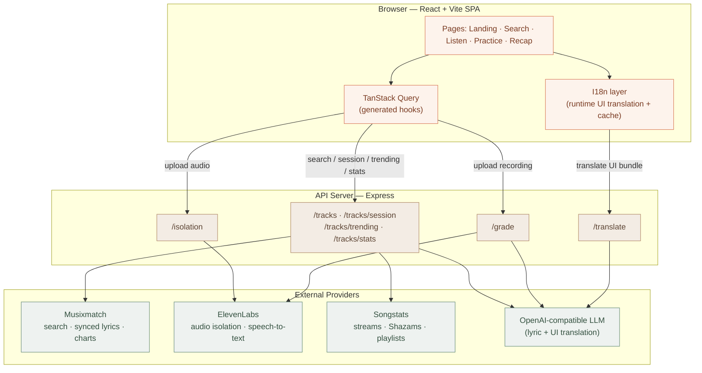

# Voxara

**Learn any language through the music you love.**

Voxara turns any song into an interactive pronunciation lesson. Search a track,
upload its audio, and Voxara isolates the vocals so you can hear every word
clearly. Read along in **Listen mode** with word-synced highlighting and
tap-to-translate lyrics, then rehearse in **Practice mode** — record yourself and
get word-by-word pronunciation grading — before finishing with a session recap.

The entire interface is **fully multilingual**: pick any of 33 languages from the
header and both the lyric translations *and* the whole app UI switch to that
language on the fly.

---

## 🏆 Musicathon 2026

Voxara was built for **[Musicathon 2026](https://musixmatch.com)** — a 7-day
online hackathon hosted by **Musixmatch** (June 15–22, 2026) with **Replit** as
the official sponsor and **ElevenLabs**, **Songstats**, **LALAL.AI**, and **n8n**
as partners.

- **Theme:** every submission must integrate and actively use the Musixmatch Pro
  API in a meaningful way. Voxara puts Musixmatch at its core — search, matching,
  and **word-level synced lyrics** (`richsync`) are what make both Listen and
  Practice mode possible.
- **Partner APIs used:** ElevenLabs (vocal isolation + speech-to-text) and
  Songstats (cross-platform popularity), exceeding the "at least one Musixmatch
  surface" requirement with three live integrations.
- **Compliance:** in keeping with the Content Usage Restrictions (no bulk
  storage / no caching of lyrics), Voxara has **no database** — lyrics are used
  only for real-time display and never persisted. See *Key design choices* below.

> Judging weighs Originality, Craft, Use of the Musixmatch Pro API, and Impact
> equally (25% each).

---

## Features

- **Track search & discovery** — search millions of songs, plus a Featured and
  Trending section with real popularity numbers.
- **Vocal isolation** — upload a song and get a clean, vocals-only stem to study.
- **Listen mode** — word-level synced highlighting that follows the audio, with
  per-line translations in your chosen language.
- **Practice mode** — record a line, get a transcript and a word-by-word accuracy
  score, and replay the model pronunciation of any word you missed.
- **Session recap** — lines practiced and average accuracy at a glance.
- **Full UI internationalization** — the whole interface translates into any of
  33 languages at runtime, with right-to-left support for Arabic, Hebrew,
  Persian, and Urdu.

---

## Architecture



**Key design choices**

- **No database.** Musixmatch's terms prohibit caching lyrics, so all session
  state lives in the browser. Only non-lyric popularity stats are cached
  in-memory on the server.
- **Contract-first API.** The OpenAPI spec generates the React Query hooks and
  Zod schemas. File-upload and array-body endpoints (`/isolation`, `/grade`,
  `/translate`) are called via raw `fetch` to avoid codegen friction.
- **Runtime UI translation.** Rather than shipping 33 static translation files,
  the UI string bundle is translated once per language by the LLM and cached in
  `localStorage`, falling back to English if translation is unavailable.

---

## How the APIs are used

### Musixmatch — the music & lyrics foundation

Musixmatch is the catalog and lyrics backbone of the app.

- **Search & match** (`track.search`) powers the search box and surfaces whether
  a track has word-level sync, line-level sync, or read-only lyrics.
- **Word-level synced lyrics** (`track.richsync.get`) drive Listen mode's
  karaoke-style highlighting and Practice mode's per-line timing.
- **Trending** (`chart.tracks.get`) populates the "Trending Now" chart on the
  landing page.

### ElevenLabs — audio in, audio understood

ElevenLabs handles everything audio.

- **Audio Isolation** (`/v1/audio-isolation`) strips the instrumental from an
  uploaded song so learners hear the vocals clearly. It runs synchronously and
  streams the isolated vocal back in a single call.
- **Speech-to-Text** (`scribe_v1`) transcribes the learner's recorded attempt in
  Practice mode; the transcript is compared against the expected line to compute
  a word-by-word pronunciation score.

### Songstats — real popularity signals

Songstats enriches each track with cross-platform performance data.

- **Track search + stats** (`tracks/search` → `tracks/stats`) attach real
  **Spotify streams**, **Shazam counts**, and **playlist placements** to each
  card. Stats are non-critical enrichment: if a match isn't found, the card
  simply renders without them.

---

## Built on Replit

Voxara was designed, built, and deployed end-to-end on **[Replit](https://replit.com)** —
the official sponsor of Musicathon 2026. Replit made it possible to ship a
multi-service app in a single hackathon week:

- **Monorepo workspace out of the box.** The API server, web frontend, and a
  component-preview sandbox each run as their own service behind Replit's shared
  reverse proxy, routed by path (`/api`, `/`) — no manual nginx or local port
  juggling.
- **Managed secrets.** All provider keys (`MUSIXMATCH_API_KEY`,
  `ELEVENLABS_API_KEY`, `SONGSTATS_API_KEY`, `SESSION_SECRET`) are stored as
  Replit Secrets and injected as environment variables — never committed to the
  repo.
- **Built-in OpenAI integration.** Lyric and UI translation use Replit's managed
  OpenAI-compatible endpoint, so no separate OpenAI account or key was needed.
- **One-click deploy.** The public demo is published as a Replit Deployment with
  automatic HTTPS, a `*.replit.app` domain, and health checks.
- **Live preview while building.** Every change is visible instantly in the
  preview pane, which is how the 33-language UI and right-to-left layouts were
  iterated on quickly.

Replit credits are provided to all Musicathon participants — use of Replit is
optional, but Voxara leans on it for the whole build-and-ship loop.

---

## Run & operate

```bash
pnpm install                                  # install workspace dependencies
pnpm --filter @workspace/api-server run dev   # API server
pnpm --filter @workspace/web run dev          # web frontend
pnpm run typecheck                            # full typecheck
pnpm --filter @workspace/api-spec run codegen # regenerate API hooks + schemas
```

**Required secrets:** `MUSIXMATCH_API_KEY`, `ELEVENLABS_API_KEY`,
`SONGSTATS_API_KEY` (ElevenLabs powers both vocal isolation and pronunciation
grading). Translation uses the Replit-managed OpenAI integration
(`AI_INTEGRATIONS_OPENAI_BASE_URL`, `AI_INTEGRATIONS_OPENAI_API_KEY`).

On Replit these are configured as **Secrets**. Running locally, copy them into a
`.env` file or export them in your shell before starting the servers.

---

## Set up from GitHub

Want to run Voxara outside Replit (or push it to your own repo for the
submission)? 

**Clone and run an existing copy:**

```bash
git clone https://github.com/<your-username>/voxara.git
cd voxara
pnpm install
# add the required secrets (see above) to a .env file
pnpm --filter @workspace/api-server run dev   # terminal 1
pnpm --filter @workspace/web run dev          # terminal 2
```

**Push this project to a new GitHub repo:**

```bash
# 1. create an empty repo on github.com (no README/.gitignore)
# 2. from the project root:
git init
git add .
git commit -m "Initial commit: Voxara"
git branch -M main
git remote add origin https://github.com/<your-username>/voxara.git
git push -u origin main
```

> **Never commit secrets.** API keys live in Replit Secrets or a local `.env`
> (already git-ignored). Double-check `git status` before your first push so no
> key is staged. The submission repo should be public, but it must not contain
> any provider keys.

On Replit you can also connect the project to GitHub directly from the **Git**
pane — no terminal required.

---

## Tech stack

- **Monorepo:** pnpm workspaces, Node.js 24, TypeScript 5.9
- **API:** Express 5, multer (streamed disk uploads), Zod validation, Pino
  logging, per-IP rate limiting + CORS origin allowlist
- **Frontend:** React + Vite, wouter, TanStack Query, Tailwind (cream/terracotta theme)
- **Codegen:** Orval from the OpenAPI spec
