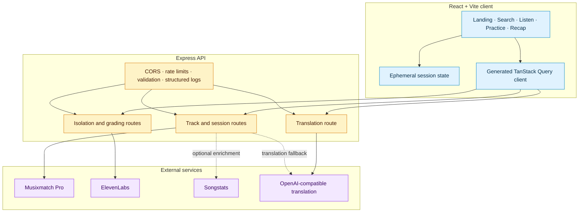

# Voxara

### Learn a language through the music you already love.

Voxara turns a song into an interactive listening and pronunciation lesson. A
learner searches for a track, uploads legally obtained audio, follows
Musixmatch-synced lyrics, reads line translations, records a spoken attempt,
and receives word-by-word feedback before reviewing a session recap.

> Built for Musicathon 2026. Musixmatch Pro is the catalog, lyrics, timing, and
> chart foundation—not a decorative integration.

**[Try the live demo](https://voxara.replit.app/)**

## Why Voxara

Traditional language exercises teach carefully scripted phrases. Songs expose
learners to rhythm, connected speech, repetition, and culture, but ordinary
lyrics pages do not help them hear a difficult phrase or verify what they said.
Voxara closes that loop in one focused flow: **discover → listen → understand →
practice → improve**.

## Musicathon judging fit

| Criterion | How Voxara addresses it |
| --- | --- |
| **Originality — 25%** | Combines karaoke-grade lyric timing with active pronunciation practice instead of stopping at passive lyric display. |
| **Craft — 25%** | Responsive multilingual interface, right-to-left support, progressive word/line/plain lyric fallbacks, explicit error states, typed API contracts, rate limits, and tests. |
| **Musixmatch Pro — 25%** | Uses search, track metadata, charts, plain lyrics, line-level subtitles, and word-level richsync in the core learning path. Without Musixmatch, the central experience does not work. |
| **Impact — 25%** | Makes authentic music usable as repeatable language-learning material across 33 interface and target languages. |

## End-to-end use case

```mermaid
flowchart LR
    Learner(["Language learner"])

    subgraph Discover["1 · Discover"]
      Search["Search by song or artist"]
      Charts["Browse featured and trending tracks"]
      Choose["Choose the best sync tier"]
    end

    subgraph Prepare["2 · Prepare"]
      Upload["Upload owned audio"]
      Isolate["Isolate the vocal stem"]
      Session["Resolve lyrics, timing, and translation"]
    end

    subgraph Learn["3 · Learn"]
      Listen["Follow karaoke-style lyrics"]
      Meaning["Read the translated line"]
      Replay["Replay a line or word"]
    end

    subgraph Practice["4 · Practice"]
      Record["Record a spoken attempt"]
      Transcribe["Transcribe speech"]
      Grade["Align words and calculate accuracy"]
      Recap["Review progress and retry"]
    end

    MXM[("Musixmatch Pro\nsearch · charts · lyrics · richsync")]
    EL[("ElevenLabs\nisolation · speech-to-text")]
    SS[("Songstats\noptional popularity context")]
    LLM[("Translation service\nfallback lyrics · interface copy")]

    Learner --> Search --> Choose --> Upload --> Isolate --> Session
    Learner --> Charts --> Choose
    Session --> Listen --> Meaning --> Replay --> Record --> Transcribe --> Grade --> Recap
    Recap -. "practice again" .-> Replay

    Search --> MXM
    Charts --> MXM
    Session --> MXM
    Search -. "enrich cards" .-> SS
    Isolate --> EL
    Transcribe --> EL
    Session -. "when provider translation is unavailable" .-> LLM

    classDef person fill:#6D28D9,stroke:#4C1D95,color:#FFFFFF,stroke-width:2px;
    classDef discover fill:#DBEAFE,stroke:#2563EB,color:#172554;
    classDef prepare fill:#FFEDD5,stroke:#EA580C,color:#431407;
    classDef learn fill:#DCFCE7,stroke:#16A34A,color:#052E16;
    classDef practice fill:#FCE7F3,stroke:#DB2777,color:#500724;
    classDef provider fill:#F3E8FF,stroke:#9333EA,color:#3B0764,stroke-width:2px;
    class Learner person;
    class Search,Charts,Choose discover;
    class Upload,Isolate,Session prepare;
    class Listen,Meaning,Replay learn;
    class Record,Transcribe,Grade,Recap practice;
    class MXM,EL,SS,LLM provider;
```



## Core experience

- **Search and discovery:** search Musixmatch by title, artist, or free text;
  featured and chart-backed tracks make the demo path immediate.
- **Progressive lyric sync:** use word-level richsync when available, fall back
  to line-level subtitles, and retain a read-only plain-lyrics experience when
  timing data is unavailable.
- **Focused listening:** isolate vocals, highlight the active lyric word, show
  the translated line, and jump directly from a line into practice.
- **Pronunciation practice:** transcribe a learner recording, align it with the
  expected lyric using tolerant edit-distance matching, and mark matched,
  substituted, and missing words.
- **Session recap:** summarize unique lines attempted and average recognition
  accuracy, then let the learner continue or choose another song.
- **International interface:** switch the interface and target translation
  across 33 languages, including right-to-left layouts.

## Musixmatch Pro integration

The server owns the API key and calls Musixmatch directly. Provider keys never
ship in the browser bundle.

| Musixmatch surface | Product role |
| --- | --- |
| `track.search` | Finds canonical tracks and reports lyric/sync availability. |
| `track.get` | Resolves canonical metadata for a selected learning session. |
| `chart.tracks.get` | Powers the trending discovery shelf. |
| `track.richsync.get` | Supplies line and word timestamps for highlighting, replay, and practice. |
| `track.subtitle.get` | Provides a timed line-level fallback when richsync is unavailable. |
| `track.lyrics.get` | Provides a plain-text fallback and mandatory copyright attribution. |

This tiered approach makes Musixmatch data operationally meaningful: it decides
what the learner sees, what can be replayed, and whether pronunciation practice
is available for a track.

## Architecture



The API is contract-first: the OpenAPI document generates Zod schemas and React
Query hooks. Lyrics and recordings are not written to a database. Browser
session state is ephemeral; only non-lyric Songstats results receive a short
in-memory cache.

## Technology

- **Frontend:** React, Vite, TypeScript, Tailwind CSS, TanStack Query, wouter
- **Backend:** Express 5, Zod, multer, Pino, in-memory rate limiting
- **Contracts:** OpenAPI, Orval-generated client hooks and schemas
- **Workspace:** pnpm monorepo, Node.js 24
- **Providers:** Musixmatch Pro, ElevenLabs, Songstats, OpenAI-compatible API
- **Build environment:** Replit

## Run locally

### Prerequisites

- Node.js 24
- pnpm 11
- Linux or Replit for the production build (the checked-in native dependency
  overrides intentionally target the Replit/Linux runtime)
- A Musicathon-issued Musixmatch Pro API key
- ElevenLabs credentials for vocal isolation and speech transcription

### Configuration

Use `.env.example` as the variable reference. Replit users should add these as
Secrets; local users should export them in the shell or load them with their own
environment manager before starting the services (the app does not implicitly
load `.env`). `SONGSTATS_API_KEY` is optional; missing Songstats data only
removes popularity badges. Translation requires the two
`AI_INTEGRATIONS_OPENAI_*` values in the current implementation.

### Commands

```bash
pnpm install
pnpm --filter @workspace/api-server run dev
pnpm --filter @workspace/web run dev
```

Run the two development services in separate terminals. Useful verification
commands:

```bash
pnpm run typecheck
pnpm --filter @workspace/api-server run test
pnpm run build
```

## Privacy, content, and contest compliance

- Musixmatch lyrics and metadata are fetched for real-time display and are not
  bulk downloaded, redistributed, or persisted by Voxara.
- Uploaded audio and learner recordings are processed for the active request;
  the application does not intentionally retain them as product data.
- Musixmatch and partner credentials remain server-side environment variables.
- Lyrics retain the copyright notice returned by Musixmatch.
- The Musicathon build is a non-commercial demonstration.

The MIT license covers the original Voxara source code only. It does not grant
rights to Musixmatch content, song recordings, provider APIs, trademarks, or
other third-party material.

## Repository map

```text
artifacts/web/          React application
artifacts/api-server/   Express API and provider integrations
lib/api-spec/           OpenAPI source contract
lib/api-zod/            Generated runtime schemas
lib/api-client-react/   Generated React API client
docs/                   Submission and compliance material
```

Submission maintainers can use the
[copy-ready Musicathon kit](docs/MUSICATHON_SUBMISSION.md).

## Author and license

Created by **Nikhil Raikwar**. Released under the [MIT License](LICENSE).
