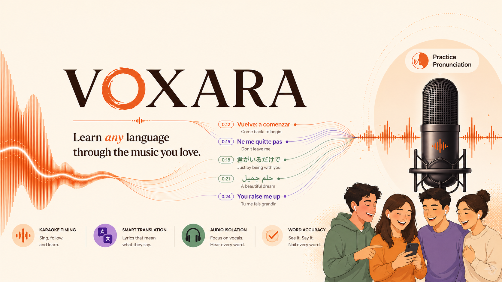

<div align="center">

# Voxara

### Learn any language through the music you love.

[](https://voxara.replit.app/)

**[Live Demo](https://voxara.replit.app/)** · [How it works](#how-it-works) · [Integrations](#partner-integrations) · [Run locally](#run-locally)

</div>

Voxara turns songs into interactive listening and pronunciation lessons. Search
for a track, isolate its vocals, follow time-synced lyrics, read translations,
practice a line aloud, and receive word-by-word feedback—all in one multilingual
learning flow.

Built for **Musicathon 2026**, Voxara uses Musixmatch Pro as its catalog, lyrics,
timing, and discovery foundation. The core experience depends on Musixmatch data;
it is not a decorative integration.

## What learners can do

- **Discover music:** search by title or artist and explore chart-backed tracks.
- **Hear every word:** upload authorized audio and isolate the vocal stem.
- **Follow the lyrics:** track the active word using Musixmatch richsync timing.
- **Understand the meaning:** read translated lines in a choice of 33 languages.
- **Practice pronunciation:** record a line and see matched, substituted, and
  missing words.
- **Review progress:** track practiced lines and average recognition accuracy.

Voxara supports right-to-left layouts for Arabic, Hebrew, Persian, and Urdu.

## How it works

```mermaid
flowchart LR
    Learner(["Language learner"])

    subgraph Discover["1 · Discover"]
      Search["Search or browse charts"]
      Select["Select a track"]
    end

    subgraph Prepare["2 · Prepare"]
      Upload["Upload authorized audio"]
      Isolate["Isolate vocals"]
      Resolve["Resolve lyrics and timing"]
    end

    subgraph Learn["3 · Listen and understand"]
      Sync["Follow synced lyrics"]
      Translate["Read line translation"]
      Replay["Replay a line or word"]
    end

    subgraph Practice["4 · Practice and improve"]
      Record["Record an attempt"]
      Grade["Grade words"]
      Recap["Review session recap"]
    end

    MXM[("Musixmatch Pro")]
    EL[("ElevenLabs")]
    SS[("Songstats")]
    Replit[("Replit")]

    Learner --> Search --> Select --> Upload --> Isolate --> Resolve
    Resolve --> Sync --> Translate --> Replay --> Record --> Grade --> Recap
    Recap -. "practice again" .-> Replay

    Search --> MXM
    Resolve --> MXM
    Search -. "optional stats" .-> SS
    Isolate --> EL
    Record --> EL
    Replit -. "hosts web and API" .-> Resolve

    classDef person fill:#6D28D9,stroke:#4C1D95,color:#FFFFFF,stroke-width:2px;
    classDef discover fill:#DBEAFE,stroke:#2563EB,color:#172554;
    classDef prepare fill:#FFEDD5,stroke:#EA580C,color:#431407;
    classDef learn fill:#DCFCE7,stroke:#16A34A,color:#052E16;
    classDef practice fill:#FCE7F3,stroke:#DB2777,color:#500724;
    classDef provider fill:#F3E8FF,stroke:#9333EA,color:#3B0764,stroke-width:2px;
    class Learner person;
    class Search,Select discover;
    class Upload,Isolate,Resolve prepare;
    class Sync,Translate,Replay learn;
    class Record,Grade,Recap practice;
    class MXM,EL,SS,Replit provider;
```



### Progressive lyric support

Voxara chooses the best experience available for each track:

1. **Word-level richsync** for karaoke highlighting and precise replay.
2. **Line-level subtitles** when word timing is unavailable.
3. **Plain lyrics** as a read-only fallback when no timing exists.

Practice mode is enabled only when the selected track has reliable timing.

## Partner integrations

| Partner | Surfaces used | Use in Voxara |
| --- | --- | --- |
| **Musixmatch Pro** | `track.search`, `track.get`, `chart.tracks.get`, `track.richsync.get`, `track.subtitle.get`, `track.lyrics.get` | Powers track discovery, canonical metadata, charts, synced highlighting, replay boundaries, lyric fallbacks, and copyright attribution. |
| **ElevenLabs** | Audio Isolation API, `scribe_v1` speech-to-text | Produces a focused vocal stem and transcribes learner recordings for word-level grading. |
| **Songstats** | Track search and statistics APIs | Optionally enriches track cards with streams, popularity, playlist placements, Shazams, TikTok views, and a Songstats link. |
| **Replit** | Workspace, Secrets, managed OpenAI-compatible integration, Deployment | Hosts the web app and API, injects server-side credentials, supports runtime translation, and publishes the [live HTTPS demo](https://voxara.replit.app/). |

Songstats enrichment is non-blocking. If its key or matching data is unavailable,
lessons continue without popularity statistics. Translation falls back to
English instead of blocking the interface.

## Architecture and engineering choices

- **Server-side provider access:** API keys never ship in the browser bundle.
- **Contract-first API:** OpenAPI generates the React Query client and Zod
  schemas used across the workspace.
- **Ephemeral learning sessions:** lyrics and recordings are not persisted to a
  product database.
- **Bounded public endpoints:** validation, CORS restrictions, rate limits, and
  structured logging protect provider-backed routes.
- **Graceful provider fallbacks:** optional enrichment never blocks the core
  Musixmatch learning flow.

### Technology

- **Frontend:** React 19, Vite, TypeScript, Tailwind CSS, TanStack Query, wouter
- **Backend:** Express 5, Zod, multer, Pino
- **Contracts:** OpenAPI and Orval-generated clients
- **Workspace:** pnpm monorepo, Node.js 24
- **Deployment:** Replit

## Run locally

### Prerequisites

- Node.js 24
- pnpm 11
- Linux or Replit for the production build
- Musixmatch Pro and ElevenLabs API credentials

Use [`.env.example`](.env.example) as the configuration reference. Replit users
should add values as Secrets. Local users must export the variables or load them
with an environment manager before starting the services; Voxara does not
implicitly load `.env` files.

`SONGSTATS_API_KEY` is optional. Translation requires
`AI_INTEGRATIONS_OPENAI_BASE_URL` and `AI_INTEGRATIONS_OPENAI_API_KEY` in the
current implementation.

```bash
pnpm install

# terminal 1
pnpm --filter @workspace/api-server run dev

# terminal 2
pnpm --filter @workspace/web run dev
```

### Verify

```bash
pnpm run typecheck
pnpm --filter @workspace/api-server run test
pnpm run build
```

## Project structure

```text
artifacts/web/          React application
artifacts/api-server/   Express API and provider integrations
lib/api-spec/           OpenAPI source contract
lib/api-zod/            Generated runtime schemas
lib/api-client-react/   Generated React API client
```

## Privacy and content handling

- Musixmatch content is fetched for real-time display and is not bulk stored or
  redistributed.
- Lyrics retain the copyright notice returned by Musixmatch.
- Uploaded audio and learner recordings are processed for the active request and
  are not intentionally retained as product data.
- The Musicathon deployment is a non-commercial demonstration.

The MIT license covers Voxara's original source code only. It does not grant
rights to lyrics, recordings, provider APIs, trademarks, or other third-party
material.

## Author and license

Created by **Nikhil Raikwar**. Released under the [MIT License](LICENSE).
