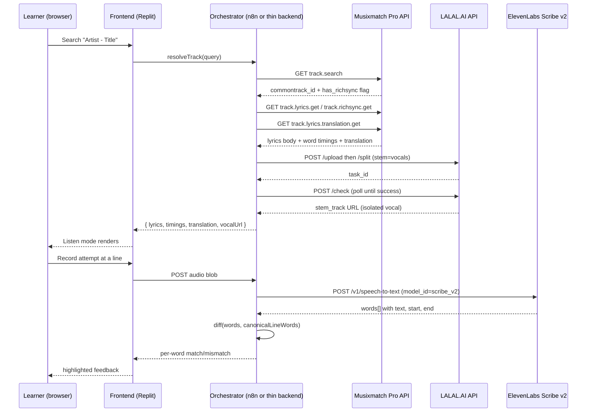

# LinguaSync — Product Requirements Document

**Musicathon 2026 · Blueprint 4 — Music-driven language & pronunciation tutor**
**Status:** Draft v1 · **Window:** 7-day hackathon build (June 15–22, 2026)

---

## 1. Overview

### 1.1 One-liner
Turn any song into an interactive pronunciation lesson: hear the isolated vocal, follow word-synced translation, then sing the line back and get instant phonetic feedback.

### 1.2 Problem
Music is one of the best-known tools for language acquisition — rhythm and melody anchor vocabulary in memory far better than flashcards. But nothing bridges "I love this song" and "I can actually say these words correctly." Lyric sites give you static, untimed text. Karaoke apps test pitch, not pronunciation. Language apps don't use real music. There's no tool that isolates a vocal, times it word-by-word, translates it, and then tells a learner specifically which sounds they got wrong.

### 1.3 Solution summary
LinguaSync takes a track the learner already likes, strips the instrumental so the vocal performance is crystal clear, displays word-level synced lyrics with tap-to-translate, and lets the learner record themselves singing/speaking a line. Their attempt is transcribed and diffed word-by-word against the canonical lyric, with mismatches highlighted so they know exactly what to fix.

### 1.4 Why this is the most buildable Musicathon blueprint
Every other shortlisted blueprint (VoxGlobalizer, EchoVerse, VibeCapital, SampleSmith) requires either real-time multi-track audio mixing, async polling chains across 3+ services, or a data-correlation backend. LinguaSync needs none of that:

| Step | API calls | Mixing required? |
|---|---|---|
| Get lyrics + translation + timing | 3 single-request Musixmatch calls | No |
| Isolate vocal | 1 LALAL.AI job (upload → split → check) | No — output is used as-is |
| Grade pronunciation | 1 ElevenLabs Scribe v2 call + a text diff | No |

No audio is ever recombined, ducked, or panned. The hardest engineering problem in the entire build is a string-alignment diff — a solved problem with well-known libraries.

---

## 2. Goals & non-goals

### 2.1 Hackathon goals (mapped to judging criteria)
- **Originality (25%):** repurpose a lyrics/translation API as an EdTech pronunciation coach — a genuinely different audience than the lyric-display or karaoke apps judges will see a dozen of.
- **Craft (25%):** a tight, responsive practice loop (record → grade → retry) with clean word-level highlighting. Polish beats scope here.
- **Use of Musixmatch Pro API (25%):** richsync, translation, and lyrics are not bolted on — they are the spine of every screen.
- **Impact (25%):** language learning is a massive, well-funded category (Duolingo, Babbel) with no music-native competitor at this depth.

### 2.2 In scope (v1, buildable in 7 days)
- Single-track session flow: search → listen → practice → score
- One target language pair at a time (e.g., Spanish → English)
- Lead-vocal isolation only (not full multistem)
- Line-level practice (not whole-song scoring)
- Web app, deployed publicly on Replit

### 2.3 Out of scope (cut if behind schedule)
- User accounts / saved progress across sessions
- Multiple simultaneous languages
- Mobile app (responsive web is enough)
- Leaderboards, gamification, streaks
- Full-multistem separation (drums/bass/etc.) — vocals-only is sufficient

---

## 3. Users & primary use case

**Persona:** an intermediate language learner who already listens to music in their target language for fun and wants to understand and pronounce what they're singing along to, instead of mumbling along to nonsense.

**Core job-to-be-done:** "Let me pick a song I like, understand what it means line by line, and find out if I'm actually saying the words right."

---

## 4. User flow

1. Learner searches for a track (artist + title) or pastes a link/ISRC.
2. App resolves the track via Musixmatch, confirms it has lyrics + richsync available, and kicks off vocal isolation in the background.
3. **Listen mode:** the isolated vocal plays; lyrics highlight word-by-word in sync. Tapping any word shows its translation inline.
4. Learner selects a line and enters **Practice mode**: the line plays once, then the learner records themselves saying/singing it.
5. The recording is transcribed and diffed against the canonical lyric. Correct words are shown in the success color, mismatched/missing words in the danger color, with the option to replay just that word from the isolated vocal as a model.
6. Learner can retry the line immediately or move to the next one. A simple session summary (lines attempted, accuracy %) closes the loop for the demo.

---

## 5. System architecture



**Components**
- **Frontend:** React (or plain HTML/JS) on Replit — public demo URL requirement satisfied automatically.
- **Orchestrator:** n8n workflow (per the report's recommendation) handling the Musixmatch → LALAL.AI → ElevenLabs sequence so the frontend never talks to three different auth schemes directly. A thin Node/Express backend is an equally valid substitute if your team is more comfortable in code than in n8n's visual editor.
- **No database.** Session state lives in memory/browser state only — see §9.

---

## 6. Functional requirements

| ID | Requirement | Acceptance criteria |
|---|---|---|
| FR1 | Track search | User can find a track by artist + title and the app resolves a Musixmatch `commontrack_id`. |
| FR2 | Lyrics + translation fetch | App displays original lyrics and a target-language translation for the resolved track. |
| FR3 | Word-level sync | Lyrics highlight in time with audio playback using richsync timestamps, accurate to roughly ±150ms. |
| FR4 | Tap-to-translate | Tapping/clicking any lyric word shows its translation without leaving the screen. |
| FR5 | Vocal isolation | The instrumental is removed so only the lead vocal plays back during Listen mode. |
| FR6 | Recording capture | User can record a short clip (one lyric line) via browser mic. |
| FR7 | Pronunciation grading | Recorded clip is transcribed and diffed word-by-word against the canonical line; mismatches are visually flagged. |
| FR8 | Retry loop | User can replay the model line and re-record without reloading the page. |
| FR9 | Graceful degradation | If a track has no richsync or translation available, the app says so clearly instead of failing silently. |

---

## 7. API integration spec

### 7.1 Musixmatch Pro API

**Base URL:** `https://api.musixmatch.com/ws/1.1/`
**Auth:** API key passed as the `apikey` query parameter on every request (the contest-issued Scale-plan key).

#### `track.search` — resolve a track
```
GET /ws/1.1/track.search?q_track={title}&q_artist={artist}&page_size=1&apikey={KEY}
```
Returns a `track` object containing `track_id`, `commontrack_id`, `has_lyrics`, `has_richsync`, and `has_lyrics_translation` flags — check these before calling the endpoints below, since not every track has every asset.

#### `track.lyrics.get` — canonical lyrics
```
GET /ws/1.1/track.lyrics.get?track_id={track_id}&apikey={KEY}
```
Returns `lyrics_body` (plain text) plus the mandatory copyright notice and tracking pixel/script that must be rendered alongside the lyrics per Musixmatch's display terms.

#### `track.richsync.get` — word-level timestamps (Pro tier)
```
GET /ws/1.1/track.richsync.get?track_id={track_id}&apikey={KEY}
```
Returns `richsync_body` as a JSON string: an array of `{ ts, te, l: [{c, o}], x }` objects per line — `ts`/`te` are line start/end in seconds, and the nested `l` array gives per-character offsets you can collapse into per-word start/end pairs. This is the timing backbone for both Listen-mode highlighting and the canonical "expected words" list used in grading.

#### `track.lyrics.translation.get` — human-quality translation
```
GET /ws/1.1/track.lyrics.translation.get?track_id={track_id}&selected_language={target_lang}&apikey={KEY}
```
Returns translated stanzas matched to the original lyric structure — this is what powers tap-to-translate.

#### Compliance notes (mandatory — read before building)
- Use the contest-issued key for Contest purposes only; do not share or hardcode it client-side in a public repo.
- **No bulk storage or caching.** Fetch lyrics/translation/richsync live, per session, on user action. Don't pre-scrape a catalog into a database — keep everything ephemeral (see §9).
- **No commercial use, no redistribution** of lyrics content outside the app's real-time display.
- Render the required copyright notice wherever lyrics are shown.

### 7.2 ElevenLabs Speech-to-Text (Scribe v2) — pronunciation grading

**Endpoint:** `POST https://api.elevenlabs.io/v1/speech-to-text`
**Auth:** `xi-api-key` header.
**Body:** multipart form.

```bash
curl -X POST "https://api.elevenlabs.io/v1/speech-to-text" \
  -H "xi-api-key: $ELEVENLABS_API_KEY" \
  -F "file=@learner_attempt.wav" \
  -F "model_id=scribe_v2" \
  -F "language_code=es" \
  -F "timestamps_granularity=word"
```

Key parameters:
- `model_id`: `scribe_v2` (batch) — accurate across 90+ languages, the right choice here over the realtime variant since you're grading discrete short clips, not streaming.
- `language_code`: pass the target language explicitly (you already know it from the track) — improves accuracy over auto-detection.
- `timestamps_granularity=word`: returns a `words[]` array, each with `text`, `start`, `end`, and `type` (`word`/`spacing`/etc.).

Example response shape:
```json
{
  "text": "quiero verte otra vez",
  "language_code": "spa",
  "words": [
    { "text": "quiero", "start": 0.08, "end": 0.41, "type": "word" },
    { "text": "verte",  "start": 0.46, "end": 0.79, "type": "word" },
    { "text": "otra",   "start": 0.85, "end": 1.02, "type": "word" },
    { "text": "vez",    "start": 1.07, "end": 1.30, "type": "word" }
  ]
}
```

### 7.3 LALAL.AI API v1 — vocal isolation

**Base URL:** `https://www.lalal.ai/api/`
**Auth:** `Authorization: license {LALAL_API_KEY}` header on every call.

Three-step async flow:

```bash
# 1. Upload the source file
curl -X POST "https://www.lalal.ai/api/upload/" \
  -H "Authorization: license $LALAL_KEY" \
  -F "file=@track.mp3"
# → { "status": "success", "id": "<source_id>" }

# 2. Start the split job (vocals stem)
curl -X POST "https://www.lalal.ai/api/split/" \
  -H "Authorization: license $LALAL_KEY" \
  --form-string 'params=[{"id":"<source_id>","stem":"vocals"}]'
# → { "status": "success", "task_id": "<source_id>" }

# 3. Poll until done, then read the stem URL
curl -X POST "https://www.lalal.ai/api/check/" \
  -H "Authorization: license $LALAL_KEY" \
  --form-string "id=<source_id>"
# → result[<id>].split.stem_track = isolated vocal URL
```
Use `stem: "vocals"` for the clean lead vocal. For a noisier mix where the lyrics are still hard to parse, `voice_clean` is the alternative preset that also reduces background bleed rather than fully removing the instrumental. Poll `/check/` every 2–3 seconds with a sane timeout/backoff — separation typically completes well within a minute for a single song.

### 7.4 Orchestration sequence (n8n)
Recommended node sequence per user action:
1. **Webhook** trigger on track selection → parallel branch: Musixmatch search/lyrics/richsync/translation calls + LALAL.AI upload/split.
2. **Wait/Poll loop** (Function + IF nodes) against LALAL.AI `/check/` until `state: success`.
3. **Merge** node combines lyrics payload + vocal URL → single JSON response to frontend.
4. Separate **Webhook** for the practice-mode recording → ElevenLabs node → diff function → response to frontend.

---

## 8. Pronunciation grading algorithm

1. Take the canonical line's words from richsync (already segmented and lowercased/normalized — strip punctuation, accents optional depending on strictness).
2. Take the Scribe v2 `words[]` output for the learner's recording.
3. Run a word-level sequence alignment (Levenshtein/edit-distance based, e.g. a standard diff library) between expected and actual word lists.
4. Classify each expected word as **match**, **substituted** (wrong word in that position), or **missing** (not said at all); flag any **extra** words the learner added.
5. Score = matched words ÷ total expected words, surfaced as a percentage plus the per-word highlight.
6. For substituted/missing words, offer a "hear it" button that replays just that word's time range from the isolated vocal (using the richsync `ts`/`te` offsets) as a model.

This is intentionally simple — exact phonetic scoring (comparing actual pronunciation, not just word recognition) is a stretch goal, not v1. Word-level recognition accuracy is what Scribe v2 is built for, and "did the learner say the right word" is a meaningful, demoable signal on its own.

---

## 9. Data model & persistence

No database is required for v1. All state is held in browser memory / React state for the duration of the session:
- Current track's lyrics, translation, richsync timings, and vocal stem URL
- Current line index and the learner's last grading result

This is a deliberate compliance choice, not just a shortcut: the Musixmatch contest terms prohibit bulk storage or caching of API content beyond what's needed for real-time display. If you want a "session recap" screen, keep it client-side and discard it on refresh — don't write lyrics or translations to a backend store.

---

## 10. UI/UX — screens

1. **Search** — single input (artist + title or paste a link), track result card with cover art and a "has richsync/translation" indicator.
2. **Listen mode** — isolated vocal player, lyrics scrolling with the active word highlighted, tap-any-word translation popover, line picker to jump into Practice mode.
3. **Practice mode** — large current-line display, "play model line" button, record button, then a graded result: word-by-word highlight (success/danger color), score %, "hear word" buttons on misses, retry/next controls.
4. **Session recap** (stretch) — lines attempted, average accuracy, "practice again" CTA.

---

## 11. Non-functional requirements

- **Compliance:** Musixmatch content fetched live per session only; contest API key never exposed in client-side bundle (proxy all Musixmatch/LALAL.AI/ElevenLabs calls through the orchestrator); no commercial framing in the demo.
- **Performance targets:** track resolution + lyrics/translation fetch under ~3s; vocal isolation under ~60s for a typical 3–4 minute song (LALAL.AI async — show a clear "isolating vocal…" state); grading round-trip under ~5s.
- **Privacy:** learner recordings are sent to ElevenLabs for transcription only and are not persisted server-side after grading; get a simple mic-permission prompt with a one-line explanation of what happens to the recording.
- **Public demo:** deployed on Replit with a live URL, per submission requirements.

---

## 12. 7-day build plan

| Day | Focus | Exit criteria |
|---|---|---|
| 1 | Musixmatch integration: search → lyrics → richsync → translation, raw JSON visible in console | Can resolve a track and print synced lyrics + translation for it |
| 2 | LALAL.AI integration: upload/split/check flow, vocal stem playable | Isolated vocal audio plays in browser for a test track |
| 3 | Listen mode UI: word highlighting synced to playback, tap-to-translate | Lyrics visibly highlight in time with the isolated vocal |
| 4 | ElevenLabs Scribe v2 integration: record → transcribe → raw word list | Can record audio and see transcribed words in console |
| 5 | Grading logic + Practice mode UI: diff algorithm, highlight rendering, retry loop | End-to-end: record a line, see graded feedback |
| 6 | Polish: error states (no richsync/translation), loading states, visual design pass, demo video | App handles a "bad" track gracefully; looks finished |
| 7 | Deploy to Replit, write submission copy, record demo video, final QA pass | Public URL live, submission complete before 14:00 CEST deadline |

---

## 13. Judging criteria alignment

| Criterion | How LinguaSync scores |
|---|---|
| Originality (25%) | Reframes a lyrics API as a language-learning tool — distinct from lyric-display, karaoke, or analytics entries. |
| Craft (25%) | A tight, responsive single loop (listen → record → grade → retry) is easier to polish in 7 days than a multi-service mixing pipeline. |
| Musixmatch Pro API use (25%) | richsync, translation, and lyrics are load-bearing on every screen, not decorative. |
| Impact (25%) | Real EdTech category, real underserved niche (music-native pronunciation practice), clear path to more languages/songs post-hackathon. |

---

## 14. Risks & mitigations

| Risk | Mitigation |
|---|---|
| Selected demo track lacks richsync or translation coverage | Pre-test and shortlist 3–5 tracks confirmed to have full Musixmatch Pro data before the live demo. |
| LALAL.AI separation queue is slow under hackathon-wide load | Pre-process your demo tracks' vocal stems early and cache the resulting URL client-side for the demo session (not a violation — this is your own generated derivative, not raw lyrics caching). |
| Scribe v2 misreads a learner's accented/non-native attempt as "wrong" | Set `language_code` explicitly and keep the matching tolerant (e.g., ignore diacritics) rather than overly strict, so the tool reads as encouraging, not punitive. |
| Mic permissions/browser audio quirks during live demo | Test on the actual demo device/browser beforehand; have a pre-recorded fallback clip ready. |

---

## 15. Demo script (suggested, ~3 minutes)

1. Search a well-known song in the target language → show the track resolves instantly.
2. Hit play in Listen mode — isolated vocal plays, lyrics highlight word-by-word; tap a word to show its translation live.
3. Jump into Practice mode on a tricky line, play the model line, record yourself attempting it (deliberately mispronounce one word for the demo).
4. Show the graded feedback: the missed word highlighted, tap "hear it," re-record, get a clean pass.
5. Close on the session recap and the one-line pitch: "Any song becomes a pronunciation lesson — for free, in real time."

---

*Prepared from Musicathon 2026 Blueprint 4. Verify current rate limits, parameter names, and endpoint availability against the live Musixmatch Pro, ElevenLabs, and LALAL.AI API docs once your contest API keys arrive, as hackathon-tier access can differ from public documentation.*
